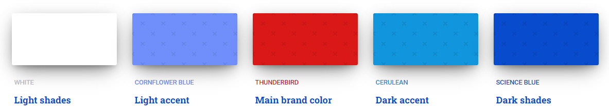
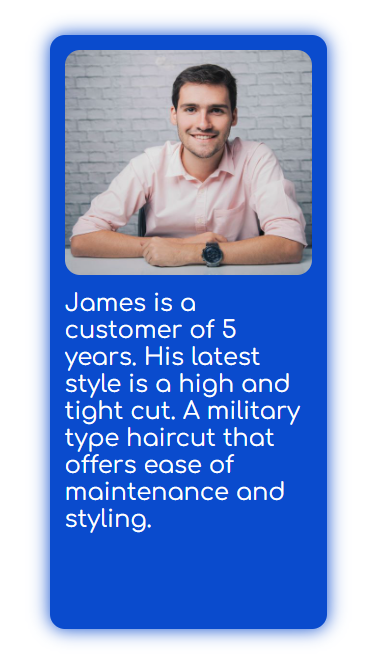
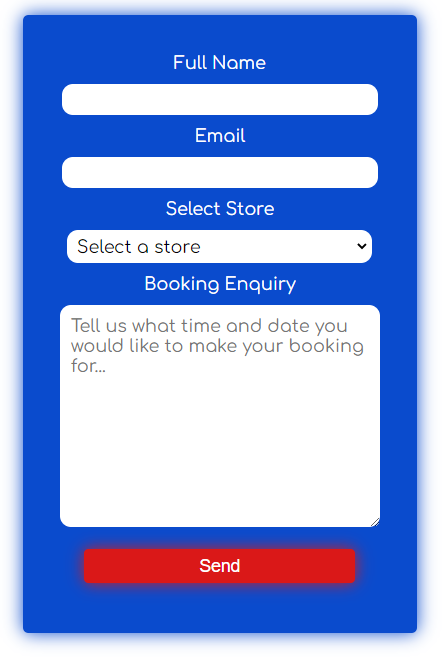

# Goal For This Project 

Welcome to “Cheap Chopping Chops”. This barber is the cheapest barbers in Dublin offering all styles from skin fades to quick trims. 

This site gives examples of the hair styles our barbers spealise in, the shockingly cheap price of these haircuts and the several locations we operate from. It allows potential customer to make booking enquiries in each of our stores via the contact form.

# Table of Contens 

* [UX](#ux "UX")
    * [User Goals](#user-goals "User Goals")
    * [User Stories](#user-stories "User Stories")
    * [Site Owner Goals](#site-owner-goals "Site Owner Goals")
* [Requirements-and-Expectations](#requirements-and-expectations "Requirements and Expectations)
    * [Requirements](#requirements-and-expectations "Requirements")
    * [Expectations](#expectations "Expectations")
* [Design-Choices](#design-choices "Design Choices")
    * [Inspiration](#inspiration "Inspiration")
    * [Fonts](#fonts "Fonts")
    * [Images](#images "Images")
    * [Icons](#Icons "Icons")
    * [Colours](#colours "Colors")
    * [Structure](#structure "Structure")
* [Wireframes](#wireframes "Wireframes")
* [Features](#features "Features")
    * [Existing-Features](#existing-features "Existing Feautres")
        * [Navigation-Bar](#navigation-bar "Navigation Bar")
        * [Landing-page](#landing-page "Landing Page")
        * [Book-Now-Section](#book-now-section "Book Now Section")
        * [Location-Section](#location-section "Location Section")
        * [Booking-Form-Section](#booking-form-section "Booking Form Section")
        * [Gallery-Section](#gallery-section "Gallery Section")
        * [Footer](#footer-section "footer section")
    * [Features-To-Be-Implemented](#features-to-be-implemented "Features to be Implemented")
* [Technologies](#technologies "Technologies")
    * [Languages](#languages "Languages")
    * [Libraries-&-Frameworks](#libraries "Libraries & Frameworks")

# UX

## User Goals 

* Form to make booking enquiries in a specific store
* Visually appealing examples that customers can use to select the style they want when making a booking 
* Easy and intuitive navigation on all screen sizes 
* Form to join the membership to receive deals

## User Stories 

* As a visitor, I want to understand the purpose of the website, which is that the barbers offers very cheap chops 
* As a visitor, I want to understand the main services on offer, including their cost
* As a visitor, I want to see examples of the styles I can request
* As a visitor, I want to easily find the different locations 
* As a visitor, I want to intuitively navigate through the content 
* As a first-time visitor, I want to join the newsletter so that I can avail of offers 
* As a visitor, I want to make enquires to book a service in a specific store 

## Site Owner Goals 

* Highlight the cheap prices 
* Increase the number signups to the newsletter
* Promote the different stores 
* Increase the search ranking on search engines

# Requirements and Expectations 

## Requirments 

* Easy to navigate on different screen sizes
* Clear information on the price of services
* Good quality images of the hair styles that are available 
* Encourage booking enquiries  
* Visuals of shop locations 
* Enquiry form that allows users to select options such as the store location, the barber, and the style 

## Expectations 

* I expect to know that my booking enquiry was submitted successfully 
* I expect that links to all of the social media open in a new tab
* I expect all content to be accurate and without grammar mistakes
* I expect to receive a discount code for joining the waitlist 
* I expect the site to be responsive and for the quality not to be impacted by the different screen sizes 
* I expect to be able to navigate to all of the pages via the navigation bar i.e., links work correctly 

# Design Choices 

## Inspiration 
 
1.  https://samsbarbers.com/ 
* The fixed nav bar will be used to allow users to access pages at any point of the site, but the background colour will be solid and not transparent so the text is always visible 
* The social media icons will be included in header 

2. https://www.area9.ie/
* The sections on the page store will be similar to the sections used to provide examples of the different styles 
* Fixed nav bar with solid background colour so text is always visible 

3. https://www.waldorfbarbers.shop/
* Parallax on the hero image will be used as seen on this site 
* The colour scheme will be like this site 

## Fonts

I have used google fonts to select a font type that best supports the goals of the website, to provide users with cheap haircuts. For the main text I have selected [Comfortaa](https://fonts.google.com/specimen/Comfortaa "Comfortaa") because the rounded edges portray a less serious, more fun, and approachable brand compared to a font with sharper edges such as [Cinzel](https://fonts.google.com/specimen/Cinzel "Cinzel"). To make the headers and the navigation bar stand out form the text, I decided to use [Valera Round](https://fonts.google.com/specimen/Varela+Round "Valera Round").

## Images

It is important that the large background image used in the hero section portrays a happy customer to align with the fun, vibrant and approachable brand. 

Again, a less serious image portrays a more approach, less premium brand and with those lower costs. 

## Icons

The font awesome library will be used throughout the site for social media links, to provide visual aides for section headers, contact links, navigation links, and more. All icons will be consistent with the fun, approachable design of the brand. 

## Colours 

The inspiration for the colours was taken from the red, white, and blue of a traditional barber’s bar. I used the website colourmind to aid me with the selection of the specific colour scheme. I tested the colours I originally selected on the WebAIM contract checker, and it failed the test, this can be seen here. To improve the contrast ratio, I adjusted the colours manually until the test past, the final colours which passed the test can be seen here. 

* FFFFFF - Background colour and font colour for inverted styles                          
* 708FFB - Used for content with an inverted colour scheme i.e form, steps to book etc.
* DA1818 - Used for buttons and to highlight active links
* 1295DC - Not used
* 3071F7 - Not used  

## Structure

I will be building my website with a mobile first mindset using the iPhone 5/SE (320px) as the smallest screen size for styling to look good on. The screen size breakpoints that I will be using are from [Bootstrap breakpoints](https://getbootstrap.com/docs/5.0/layout/breakpoints/ "Bootstrap breakpoints").

| Screen Size | Breakpoint |
| ----------- | ---------- |
| x-small     | <576px     |
| small       | => 576px   |
| medium      | => 768px   |
| large       | => 992px   |
| x-large     | => 1200px  |

# Wireframes 

I have used [Balsamic](https://balsamiq.com/wireframes/ "Balsamic") to develop my wireframes for my website. I initially created the desktop version of the wireframes and then scalled it up down for both tablet and mobile versions. 

Because it is both a requirement and a site owner goal  to encourage booking enquires I have added two CTAs in the intial sections of the site. Furthermore, because this is a one-page website the user is forced to scroll through all of the site content before they reach the booking form at the bottom of the page. Therfore, they are more likely to make a booking after consuming all of the information on the site.  

The wireframes are below:

### [Desktop Wireframe](assets/css/wireframes/Desktop.pdf "Desktop wireframe")
### [Tablet Wireframe](assets/css/wireframes/Tablet.pdf "Tablet wireframe")
### [Phone Wireframe](assets/css/wireframes/Phone.pdf "Phone wireframe")

# Features 

## Existing Features 

### Navigation Bar 

The navigation bar includes a logo which will have an embedded link to the home page, and a menu for users to navigate throughout the site. 
The navigation bar will be fixed so it is always visible on screen. The navigation bar will be fully responsive on different screen sizes. 

#### Large Screens and up

* Full width of the screen with the menu items aligned to the right of the screen (Home, Price, Gallery, Locations and Book Now)
* A line will be visible on hover so that it is clear to the user which link they are going to click 
* To help the user identify which page they are currently on the text for that page will change colour 

* on hover the menu items are underlined to make it obvious which link the user is about to click on 

* When the user clicks a link the font color changes to red and the text is rotated on the Y-axis to give the user the impression the link moved when it was clicked

#### Small to Medium

* A hamburger menu will replace the listed menu items on smaller screens to optimize screen space 
* The menu items will be visible after the hamburger menus is expanded by a user clicking it 
* Both the logo and the brand name will also be visible at these screen sizes

#### Extra Small 

* Only the logo and the hamburger menu will be visible at this screen size 

### Hamburger Menu

### Book Now Button

* The book now button was styled so that it appears as if it illuminiscent or glowing. For large screens and up when a user hovers over the button it expands in size and a shadow effect before the button is applied. These features are applied by default on screens that are medium and below.

Button without hover effect on large and above screen sizes:

Button with hover effect on large and above screen:

Default button on medium and below screen sizes:

### Hero Image 

* The main image on the landing page will portray the main concepts of the website. The image will be coloured and show a smiling customer who has recently had their hair cut. The image is clearly displaying a customer happy with the service and it is also immediately clear to a visitor what the purpose of the website is. 

### Gallery tiles 

* The gallery section includes rectangular tyles with images that display example hair cuts that were submitted by customers
* The tiles are include two sections:
    * An image of the customers haircut
    * A description of the style 

### Location information 

The location section consists of information on the three stores overlaying an image. The sections provide an address, opening days and times for each store 

#### Large Screens and up

* The locations are listed as individual rectangular sections horizontally across the width of the screen 

#### Mediun screens and below 

* The locations are listed as individual rectangular sections vertically

### How to book steps   

### Booking Form  

* The form on this page includes the following fields 
    * Full name
    * Email 
    * Selector for stores
    * Text box
    * Submit button
* The fields are all required fields and the email field requires the user to enter a value that follows a valid email format
* There is also a map with a pin for each of the four stores 

### Map    

### Social media icons  

* The footer contains icons which are clickable links for social media platforms 
* On hover these icons are rotated on the Y-axis to give the user the impression they have jumped up 

## Features to be implemented 

* Hamburger menu exit button
* Embeded google map with multiple pins 
* Hamburger menu exit button
* Confirmation screen for form  
* Online booking system 

# Technologies 

## Languages 

* [HTML](https://en.wikipedia.org/wiki/HTML "HTML")
* [CSS](https://en.wikipedia.org/wiki/CSS "CSS")

## Libraries 

* [google-fonts](https://fonts.google.com/ "Google Fonts")
* [font-awesome](https://fontawesome.com/ "Font Awesome")

## Tools 

* [Gitpod](https://www.gitpod.io/ "Gitpod")
* [Github](https://github.com/ "Github")
* [Balsamic](https://balsamiq.com/wireframes/ "Balsamic")
* [W3C HTML Validation Service](https://validator.w3.org/ "W3C HTML Validation Service")
* [W3C CSS Validation Service](https://jigsaw.w3.org/css-validator/ "W3C CSS Validation Service")
* [Colourmind](http://colormind.io/ "Colourmind")
* [font-awesome](https://fontawesome.com/ "Font Awesome")
* [google-fonts](https://fonts.google.com/ "Google Fonts")
* [Pexles](https://www.pexels.com/ "Pexles")
* [Canva](https://www.canva.com/ "Canva")
* [Chrome Dev Tools](http://colormind.io/ "Chrome Dev Tools")
* [SauceLabs](https://saucelabs.com/platform/mobile-emulators-and-simulators "SauceLabs")

# Testing 

I believe that the site is intuative and user friendly. There are few large empty spaces and the content of the site responds well to different screen sizes without breaking. The imgages remain clean and sharp at different resolutions. The site hamburger menu and the nav bar provide users with an intuative means to navigate the site at different screen sizes. Each section is accessible via the links in the nav bar which is fixed to the users screen. Furthermore, there are few sections with significant amounts of text, preventing the site from becoming over crowded. 

During teting I encountered the following issues:

* The navigating links in the hamburger menu do not work as expected on certain devices and browsers. For example, when the links are clicked on chrome the hamburger menu closes without linking the user to the specific section which they have clicked. However, on an iPhone SE using Safari the hamburger menu works as expected. 

* The book now button initially had a transparent background and text shadow. This stlye was applied in an attempt to give the button a neon effect. However, it was far too dififuclt to read the text within the button when this style was applied. I decided to implement the on-hover background and font color style by default. 

* The locations section initially had a flex-direction: row for all screen sizes but for devices below 992px text was overflowing the background image. I for screens smaller then 992px I set the flex-direction to be column and changed the width fromm 33% to 100" so the contnet presented vertically. With more room this prevent the contnet from overflowing the background image. 

* I had issues with the header covering the section titles when clicking on a link. I applied a scroll padding top so the header did not cover section headings. 

* I found that I was targeting elements rather then using IDs or Classes for some of my code. This resulted in inefficent CSS. I added an ID and Class to all elements which were targeted in my CSS.

* I intially added media queries throughout my CSS. I later realised this was incorrect and positioned them in the correct sequence at the bottom of my stlye sheet. 

* When I validated my HTML I found that I was repeating an ID across multiple elements in the form, I changed the ID form-field to a class. 

* When I validated my CSS I found that I had commented out code which should be removed. 

* I intially decided to create my site without a max widht on the content. I found that on larger screens above 1200px that the content stretched to wide and it did not present well. I applied a max-width of 1200px across several sections. 

* I origianlly used a line clamp for the text in the gallery tiles but this prevented all of the text from being displayed. I removed this line clamp and applied a fix height to all of the tiles. 

## Unfixed Bugs

* The navigating links in the hamburger menu do not work as expected on certain devices and browsers. For example, when the links are clicked on chrome the hamburger menu closes without linking the user to the specific section which they have clicked. However, on an iPhone SE using Safari the hamburger menu works as expected. 

# Deployment

After the code for this website was written, committed and pushed to github, it was then deployed using GitHub by following the below steps:

* Open Github
* Navigate to the repository on GitHub using the search bar
* Within the repository click "settings"
* On the settings tab click "Pages" on the side navigation 
* For the sourse dropdown select "Deploy from branch"
* In the branch section select "Main" on the first drop down menu 
* In the branch section select "/(root)" on the second drop down menu
* Then press save 
* Now the website is live on https://oran-123.github.io/Cheap-Chopping-Chops/#price
* If any changes are required they can be written, committed and pushed to GitHub. The website will update shortly after the commits are pushed. 
# Credits 

For code inspiration:

* [Simen Daehlin](https://github.com/Eventyret "Simen Daehlin") 
* [Kevin Powel](https://www.youtube.com/@KevinPowell "Kevin Powel")
* [Before Semicolon Youtube Channel](https://www.youtube.com/@BeforeSemicolon "Before Semicolon Youtube Channel")

